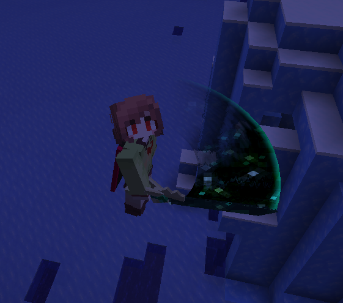
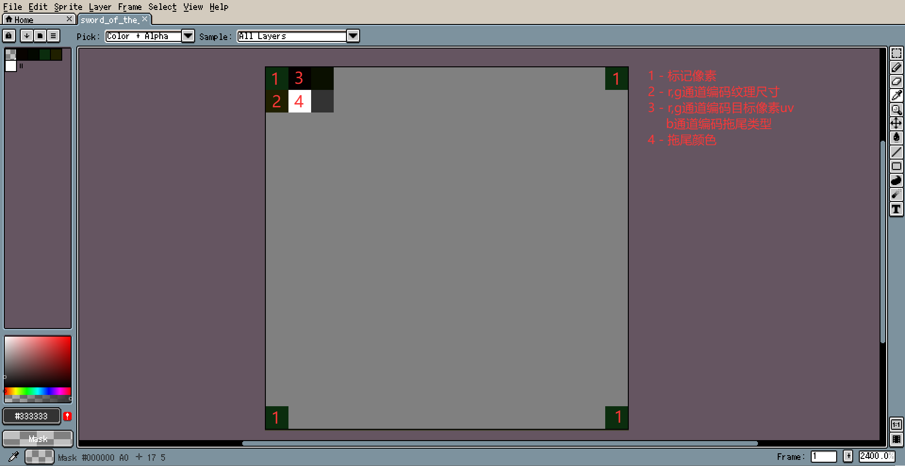

# BladeFlash - 世界空间拖尾
## 简介
基于世界空间重建和后处理模拟光栅化的世界空间拖尾。



## 使用
### 纹理

如图所示，四个角用(11,45,14)标记；(0,1)用r,g通道编码纹理尺寸；(i+1,0)用r,g通道编码第i个拖尾顶点的uv，b通道编码第i个拖尾顶点的特效类型。
### 模型
WIP
### 配置
WIP
### 一些预制特效
#### 末地门星空
```give @s minecraft:diamond_sword[minecraft:item_model=sword_of_the_end]```
#### 空气扭曲
WIP
#### 故障效果
WIP
## 原理
WIP


## 特别感谢

轩宇1725 - [精准采样纹理](https://vanillalibrary.mcfpp.top/datapack-index/feature/archive/202607/4/content.html)